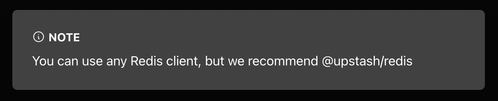
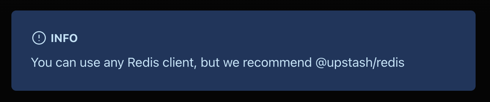
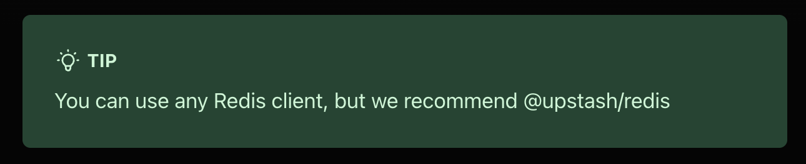
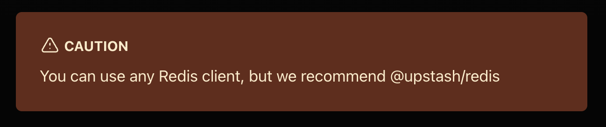
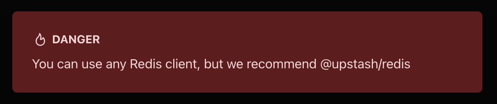
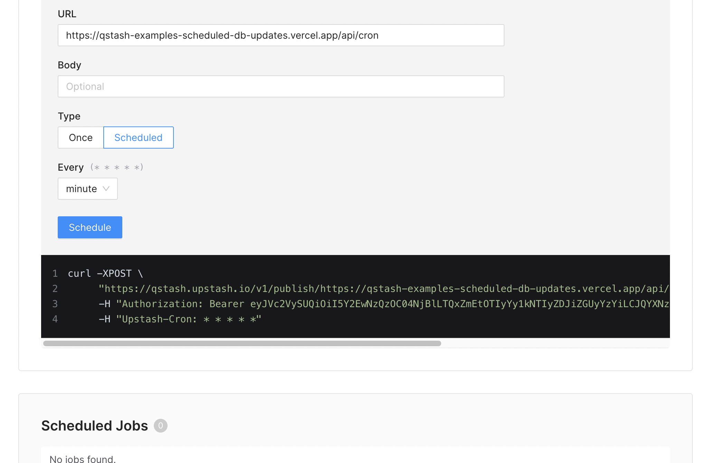
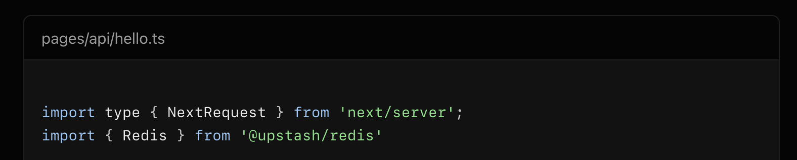
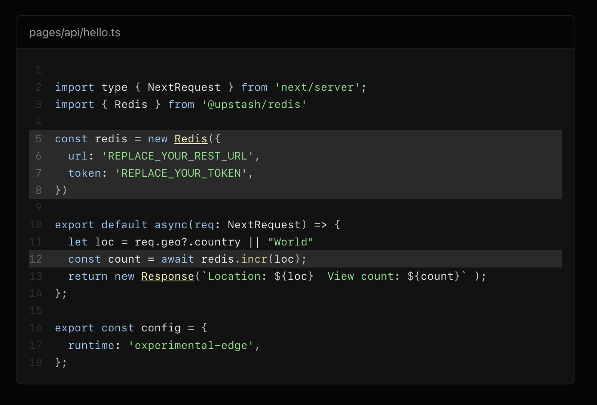
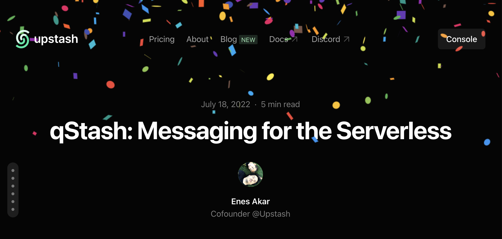

# Upstash

## Blog Post Features

---

#### Note



```mdx
<Note>You can use any Redis® client, but we recommend @upstash/redis</Note>
```



```mdx
<Note type="info">
  You can use any Redis® client, but we recommend @upstash/redis
</Note>
```



```mdx
<Note type="tip">
  You can use any Redis® client, but we recommend @upstash/redis
</Note>
```



```mdx
<Note type="caution">
  You can use any Redis® client, but we recommend @upstash/redis
</Note>
```



```mdx
<Note type="danger">
  You can use any Redis® client, but we recommend @upstash/redis
</Note>
```



```mdx
<Note title="custom">
  You can use any Redis® client, but we recommend @upstash/redis
</Note>
<Note title="custom" danger>
  You can use any Redis® client, but we recommend @upstash/redis
</Note>
```

---

#### Code Block



````mdx
```javascript title:"pages/api/hello.ts"
import type { NextRequest } from 'next/server';
import { Redis } from '@upstash/redis';
```
````



````mdx
```javascript:pages/api/hello.ts showLineNumbers {5-8,12}
import type { NextRequest } from 'next/server';
import { Redis } from '@upstash/redis'
```
````

---

#### Announcing (Confetti)



```mdx
---
slug: qstash-announcement
title: "qStash: Messaging for the Serverless"
author: enes
tags: [announce]
---
```

---

#### Tags

Tags group posts under `/blog/tag/<tag>`. Conventions:

- Always use **lowercase kebab-case** in frontmatter: `aws-lambda`, not
  `AWS Lambda` or `awslambda`. Don't wrap tags in quotes.
- Tag matching is case- and whitespace-insensitive (via `normalizeTag` in
  `src/utils/tags.ts`), so `Vector`, `vector`, `semantic search` and
  `semantic-search` resolve to the same page — but please write the
  normalized form so counts and the popular-tag row dedupe correctly.
- Add every topic that applies. An article about Upstash Redis Search
  should include both `redis` and `search`, so it surfaces under
  `/blog/tag/redis` **and** `/blog/tag/search`. Posts that are about
  semantic search must carry both `search` and `semantic-search`.
- Display labels for multi-word or acronym tags live in `TAG_NAMES`
  (`src/utils/const.ts`). If you introduce a new multi-word tag, add
  an entry so the pill row renders it nicely (e.g. `"feature-flags":
  "Feature Flags"`). Single-word tags fall back to CSS `capitalize`.

```mdx
---
title: "A First Look at Upstash Redis Search"
slug: first-look-at-upstash-redis-search
authors: [josh]
tags: [redis, search]
---
```

**Canonical tag names** (use these; don't invent variants):

| Canonical | Avoid |
| --- | --- |
| `ratelimit` | `rate-limiting`, `ratelimiting`, `rate-limit`, `ratelimiter` |
| `nextjs` | `next.js`, `NextJS` |
| `aws-lambda` | `awslambda`, `lambda` |
| `sveltekit` | `svelte-kit` |
| `nuxt` | `nuxtjs` |
| `announcement` | `announce` |
| `webhook` | `webhooks` |
| `scheduler` | `schedule`, `scheduling` |
| `connectors` | `connector` |
| `cache` | `caching` (keep `semantic-cache` as its own tag) |
| `authentication` | `authenticatio` |
| `feature-flags` | `feature, flag` (two separate tags) |
| `environment-variables` | `environment, variable, env` |
| `search`, `semantic-search` | single-worded `semantic` alone |

If you ever need to re-run the consolidation (e.g. after importing
external posts), `scripts/consolidate-blog-tags.mjs` is idempotent —
it rewrites `tags: [...]` in every `data/blog/*.mdx` according to the
rules above.

## Snipsync

We use [snipsync](https://github.com/temporalio/snipsync) to synchronize snippets from other repos (like redis-examples) to the docs, so they are deduplicated.
Snipsync runs automatically when you do `yarn build`

### How to use:

#### Source files:

Use comments to identify code snippets and the locations where they should be merged.
In the source repo, wrap the code snippets in comments with a unique snippet identifier like this:

```go
// @@@SNIPSTART hellouniverse
func HelloUniverse() {
        fmt.Println("Hello Universe!")
}
// @@@SNIPEND
```

In the example above, "hellouniverse" is the unique identifier for the code snippet.
Unique identifiers can contain letters, numbers, hyphens, and underscores.

#### Docs files:

In the target files wrap the location with comments that reference the identifier of the code snippet that will be placed there:

<!--SNIPSTART hellouniverse-->
<!--SNIPEND-->

In the example above, the "hellouniverse" code snippet will be spliced between the comments. Any text inside of the placeholders will be replaced by the code snippet when the tool runs.
