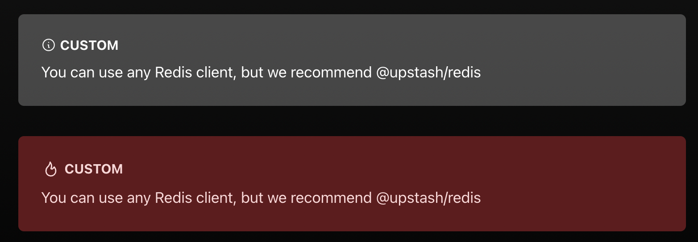

# Upstash

## Blog Post Features

---

#### Note


```mdx
<Note>You can use any Redis® client, but we recommend @upstash/redis</Note>
```


```mdx
<Note type="info">
  You can use any Redis® client, but we recommend @upstash/redis
</Note>
```


```mdx
<Note type="tip">
  You can use any Redis® client, but we recommend @upstash/redis
</Note>
```


```mdx
<Note type="caution">
  You can use any Redis® client, but we recommend @upstash/redis
</Note>
```


```mdx
<Note type="danger">
  You can use any Redis® client, but we recommend @upstash/redis
</Note>
```



```mdx
<Note title="custom">
  You can use any Redis® client, but we recommend @upstash/redis
</Note>
<Note title="custom" danger>
  You can use any Redis® client, but we recommend @upstash/redis
</Note>
```

---

#### Code Block


````mdx
```javascript title="pages/api/hello.ts"
import type { NextRequest } from 'next/server';
import { Redis } from '@upstash/redis';
```
````


````mdx
```javascript title="pages/api/hello.ts" ins={1} del={2}
import type { NextRequest } from 'next/server';
import { Redis } from '@upstash/redis'
```
````

---

#### Announcing (Confetti)


```mdx
---
slug: qstash-announcement
title: "qStash: Messaging for the Serverless"
author: enes
tags: [announce]
---
```

## Snipsync

We use [snipsync](https://github.com/temporalio/snipsync) to synchronize snippets from other repos (like redis-examples) to the docs, so they are deduplicated.
Snipsync runs automatically when you do `yarn build`

### How to use:

#### Source files:

Use comments to identify code snippets and the locations where they should be merged.
In the source repo, wrap the code snippets in comments with a unique snippet identifier like this:

```go
// @@@SNIPSTART hellouniverse
func HelloUniverse() {
        fmt.Println("Hello Universe!")
}
// @@@SNIPEND
```

In the example above, "hellouniverse" is the unique identifier for the code snippet.
Unique identifiers can contain letters, numbers, hyphens, and underscores.

#### Docs files:

In the target files wrap the location with comments that reference the identifier of the code snippet that will be placed there:

<!--SNIPSTART hellouniverse-->
<!--SNIPEND-->

In the example above, the "hellouniverse" code snippet will be spliced between the comments. Any text inside of the placeholders will be replaced by the code snippet when the tool runs.%
