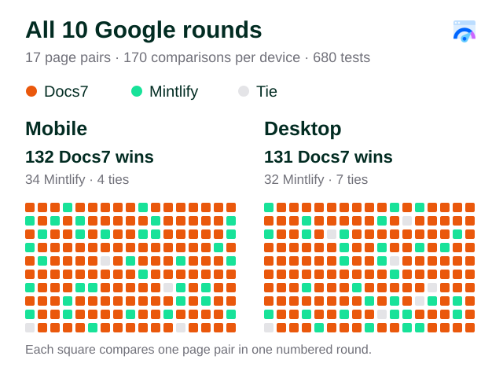
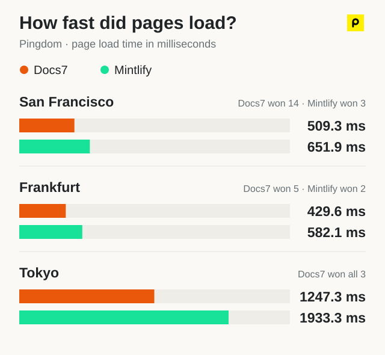

# Docs7 vs. Mintlify: full benchmark results

Tests collected September 17–18, 2026. Google tests were run on September 17. This is the data appendix for the [Upstash blog post](https://upstash.com/blog/docs7-vs-mintlify).

We tested 17 matching page paths from two documentation projects: 7 Upstash pages and 10 Context7 pages. Every row links to both hosted versions. These are deployed-site comparisons, not a controlled comparison of the two renderers. Live pages can change after the test.

## Test setup

| Service                   | Coverage                                          | Runs per URL | Test location and device                                                                            |
| ------------------------- | ------------------------------------------------- | ------------ | --------------------------------------------------------------------------------------------------- |
| Google PageSpeed Insights | 17 page pairs on each device                      | 10           | Hosted mobile and desktop strategies; Lighthouse 13.4.1                                             |
| DebugBear                 | 10 page pairs on each device                      | 1–2          | US East; mobile: 12 Mbps, 70 ms RTT, 2× CPU; desktop: 100 Mbps, 2 ms RTT, 1× CPU; Lighthouse 13.4.0 |
| Pingdom                   | 17 San Francisco, 7 Frankfurt, 3 Tokyo page pairs | 1–3          | Desktop; each location kept separate                                                                |

Google provides 680 measurements. DebugBear provides 50 and Pingdom provides 66. All 796 completed, matched measurements are retained. Each pair has the same number of runs on both hosts.

The Google tables use the median of 10 runs. DebugBear and Pingdom use the median when a URL has multiple runs; with two runs this is their average. Summary charts average the per-page medians with equal weight for each page. Services, devices, and test locations are never pooled. Bold marks the higher score or lower load time.

These tests measure initial page loads. We did not play videos or test interaction latency. Cache state was not controlled, and paired hosts were not always tested at the same time. The page set is a sample, not a random sample of all documentation.

## Google PageSpeed Insights

[All 680 Google measurements, with tested URLs, timestamps, and metrics](../public/blog/docs7-vs-mintlify/google-runs.csv). The API returned data, not permanent hosted report links. This CSV is our export of those responses.

| Page content                | Project  | Docs7 page                                                                        | Mintlify page                                                                    | Mobile · Docs7 / Mintlify | Desktop · Docs7 / Mintlify |
| --------------------------- | -------- | --------------------------------------------------------------------------------- | -------------------------------------------------------------------------------- | ------------------------: | -------------------------: |
| Screenshot reference        | Upstash  | [Docs7](https://upstash-docs.docs7.io/docs/redis/howto/metrics-and-charts)        | [Mintlify](https://upstash.mintlify.dev/docs/redis/howto/metrics-and-charts)     |             **69** / 50.5 |              **98** / 79.5 |
| Video and component catalog | Upstash  | [Docs7](https://upstash-docs.docs7.io/docs/workflow/getstarted)                   | [Mintlify](https://upstash.mintlify.dev/docs/workflow/getstarted)                |             **64.5** / 50 |              **78** / 66.5 |
| Tabbed setup guide          | Context7 | [Docs7](https://upstash-context7.docs7.io/docs/howto/claiming-libraries)          | [Mintlify](https://context7.mintlify.dev/docs/howto/claiming-libraries)          |             **91** / 64.5 |              **97.5** / 93 |
| Step-by-step instructions   | Context7 | [Docs7](https://upstash-context7.docs7.io/docs/docs7/components/steps)            | [Mintlify](https://context7.mintlify.dev/docs/docs7/components/steps)            |             **91** / 59.5 |              **95** / 87.5 |
| Release notes               | Context7 | [Docs7](https://upstash-context7.docs7.io/docs/docs7/components/updates)          | [Mintlify](https://context7.mintlify.dev/docs/docs7/components/updates)          |           **92.5** / 75.5 |                96.5 / 96.5 |
| Long CLI guide              | Context7 | [Docs7](https://upstash-context7.docs7.io/docs/clients/cli)                       | [Mintlify](https://context7.mintlify.dev/docs/clients/cli)                       |             **89.5** / 54 |              **96** / 88.5 |
| Long API reference          | Upstash  | [Docs7](https://upstash-docs.docs7.io/docs/redis/features/restapi)                | [Mintlify](https://upstash.mintlify.dev/docs/redis/features/restapi)             |             **57** / 46.5 |              **93** / 86.5 |
| Expandable API fields       | Upstash  | [Docs7](https://upstash-docs.docs7.io/docs/redis/sdks/ts/commands/string/set)     | [Mintlify](https://upstash.mintlify.dev/docs/redis/sdks/ts/commands/string/set)  |             **85** / 46.5 |              **98.5** / 86 |
| Scheduling guide            | Upstash  | [Docs7](https://upstash-docs.docs7.io/docs/qstash/features/schedules)             | [Mintlify](https://upstash.mintlify.dev/docs/qstash/features/schedules)          |               **72** / 52 |            **94.5** / 91.5 |
| Retry guide and formulas    | Upstash  | [Docs7](https://upstash-docs.docs7.io/docs/qstash/features/retry)                 | [Mintlify](https://upstash.mintlify.dev/docs/qstash/features/retry)              |             **72.5** / 46 |                **98** / 85 |
| SDK setup guide             | Upstash  | [Docs7](https://upstash-docs.docs7.io/docs/redis/sdks/ts/getstarted)              | [Mintlify](https://upstash.mintlify.dev/docs/redis/sdks/ts/getstarted)           |           **62.5** / 57.5 |              **99** / 88.5 |
| Cards and code              | Context7 | [Docs7](https://upstash-context7.docs7.io/docs/overview)                          | [Mintlify](https://context7.mintlify.dev/docs/overview)                          |           **65.5** / 64.5 |                **96** / 93 |
| Custom React component      | Context7 | [Docs7](https://upstash-context7.docs7.io/docs/docs7/components/react-components) | [Mintlify](https://context7.mintlify.dev/docs/docs7/components/react-components) |             **92** / 75.5 |            **95.5** / 90.5 |
| Tabbed content              | Context7 | [Docs7](https://upstash-context7.docs7.io/docs/docs7/components/tabs)             | [Mintlify](https://context7.mintlify.dev/docs/docs7/components/tabs)             |               **88** / 67 |            **92.5** / 91.5 |
| Collapsible content         | Context7 | [Docs7](https://upstash-context7.docs7.io/docs/docs7/components/accordions)       | [Mintlify](https://context7.mintlify.dev/docs/docs7/components/accordions)       |             **90** / 74.5 |              **96** / 95.5 |
| Nested file tree            | Context7 | [Docs7](https://upstash-context7.docs7.io/docs/docs7/components/tree)             | [Mintlify](https://context7.mintlify.dev/docs/docs7/components/tree)             |             **91.5** / 58 |              **96** / 91.5 |
| Generated diagrams          | Context7 | [Docs7](https://upstash-context7.docs7.io/docs/docs7/components/mermaid)          | [Mintlify](https://context7.mintlify.dev/docs/docs7/components/mermaid)          |           **88.5** / 59.5 |                **93** / 91 |

### All 10 Google rounds

These are 170 repeated comparisons per device, not 170 different pages. Each square matches the same page, device, and numbered round. The runs were not necessarily simultaneous.

## DebugBear

Scores out of 100. Small numbered links open every recorded test report. Three mobile pairs and two desktop pairs have two runs per URL; the remaining pairs have one.

### Mobile

| Page content                | Project  | Docs7 page                                                                        | Mintlify page                                                                    | Docs7 score | Mintlify score | Runs per host | Docs7 reports                                                                                                                           | Mintlify reports                                                                                                                        |
| --------------------------- | -------- | --------------------------------------------------------------------------------- | -------------------------------------------------------------------------------- | ----------: | -------------: | ------------: | --------------------------------------------------------------------------------------------------------------------------------------- | --------------------------------------------------------------------------------------------------------------------------------------- |
| Screenshot reference        | Upstash  | [Docs7](https://upstash-docs.docs7.io/docs/redis/howto/metrics-and-charts)        | [Mintlify](https://upstash.mintlify.dev/docs/redis/howto/metrics-and-charts)     |      **77** |             72 |             2 | [1](https://www.debugbear.com/test/website-speed/zRuOKMAd/overview) [2](https://www.debugbear.com/test/website-speed/Yzo2MgN9/overview) | [1](https://www.debugbear.com/test/website-speed/ynjOhSqD/overview) [2](https://www.debugbear.com/test/website-speed/DgkPgJ5Y/overview) |
| Video and component catalog | Upstash  | [Docs7](https://upstash-docs.docs7.io/docs/workflow/getstarted)                   | [Mintlify](https://upstash.mintlify.dev/docs/workflow/getstarted)                |      **72** |             63 |             1 | [1](https://www.debugbear.com/test/website-speed/dESPedJL/overview)                                                                     | [1](https://www.debugbear.com/test/website-speed/HYv0g0f5/overview)                                                                     |
| Tabbed setup guide          | Context7 | [Docs7](https://upstash-context7.docs7.io/docs/howto/claiming-libraries)          | [Mintlify](https://context7.mintlify.dev/docs/howto/claiming-libraries)          |      **76** |             72 |             1 | [1](https://www.debugbear.com/test/website-speed/NNwHZwVe/overview)                                                                     | [1](https://www.debugbear.com/test/website-speed/LypwhBu1/overview)                                                                     |
| Step-by-step instructions   | Context7 | [Docs7](https://upstash-context7.docs7.io/docs/docs7/components/steps)            | [Mintlify](https://context7.mintlify.dev/docs/docs7/components/steps)            |      **77** |             74 |             1 | [1](https://www.debugbear.com/test/website-speed/TYadCHcB/overview)                                                                     | [1](https://www.debugbear.com/test/website-speed/vlFkoSh7/overview)                                                                     |
| Long API reference          | Upstash  | [Docs7](https://upstash-docs.docs7.io/docs/redis/features/restapi)                | [Mintlify](https://upstash.mintlify.dev/docs/redis/features/restapi)             |      **73** |             71 |             2 | [1](https://www.debugbear.com/test/website-speed/NP3UqFhH/overview) [2](https://www.debugbear.com/test/website-speed/eYfLApgS/overview) | [1](https://www.debugbear.com/test/website-speed/bDCHIcMD/overview) [2](https://www.debugbear.com/test/website-speed/1Irvw0DA/overview) |
| Expandable API fields       | Upstash  | [Docs7](https://upstash-docs.docs7.io/docs/redis/sdks/ts/commands/string/set)     | [Mintlify](https://upstash.mintlify.dev/docs/redis/sdks/ts/commands/string/set)  |      **75** |             71 |             1 | [1](https://www.debugbear.com/test/website-speed/aITGEd2e/overview)                                                                     | [1](https://www.debugbear.com/test/website-speed/2ZpkboRz/overview)                                                                     |
| Cards and code              | Context7 | [Docs7](https://upstash-context7.docs7.io/docs/overview)                          | [Mintlify](https://context7.mintlify.dev/docs/overview)                          |      **75** |           73.5 |             2 | [1](https://www.debugbear.com/test/website-speed/lAkrN33n/overview) [2](https://www.debugbear.com/test/website-speed/JesWDUMA/overview) | [1](https://www.debugbear.com/test/website-speed/LmPMxXB9/overview) [2](https://www.debugbear.com/test/website-speed/FdvpSNeD/overview) |
| Custom React component      | Context7 | [Docs7](https://upstash-context7.docs7.io/docs/docs7/components/react-components) | [Mintlify](https://context7.mintlify.dev/docs/docs7/components/react-components) |      **78** |             72 |             1 | [1](https://www.debugbear.com/test/website-speed/aplQVDYf/overview)                                                                     | [1](https://www.debugbear.com/test/website-speed/5Y8DlZlO/overview)                                                                     |
| Tabbed content              | Context7 | [Docs7](https://upstash-context7.docs7.io/docs/docs7/components/tabs)             | [Mintlify](https://context7.mintlify.dev/docs/docs7/components/tabs)             |      **80** |             74 |             1 | [1](https://www.debugbear.com/test/website-speed/6KwQXJE3/overview)                                                                     | [1](https://www.debugbear.com/test/website-speed/WBXq6IPf/overview)                                                                     |
| Generated diagrams          | Context7 | [Docs7](https://upstash-context7.docs7.io/docs/docs7/components/mermaid)          | [Mintlify](https://context7.mintlify.dev/docs/docs7/components/mermaid)          |      **73** |             71 |             1 | [1](https://www.debugbear.com/test/website-speed/rZSrBqBA/overview)                                                                     | [1](https://www.debugbear.com/test/website-speed/jPst3vXe/overview)                                                                     |

### Desktop

| Page content                | Project  | Docs7 page                                                                        | Mintlify page                                                                    | Docs7 score | Mintlify score | Runs per host | Docs7 reports                                                                                                                           | Mintlify reports                                                                                                                        |
| --------------------------- | -------- | --------------------------------------------------------------------------------- | -------------------------------------------------------------------------------- | ----------: | -------------: | ------------: | --------------------------------------------------------------------------------------------------------------------------------------- | --------------------------------------------------------------------------------------------------------------------------------------- |
| Screenshot reference        | Upstash  | [Docs7](https://upstash-docs.docs7.io/docs/redis/howto/metrics-and-charts)        | [Mintlify](https://upstash.mintlify.dev/docs/redis/howto/metrics-and-charts)     |      **82** |           70.5 |             2 | [1](https://www.debugbear.com/test/website-speed/RyKYQ4bf/overview) [2](https://www.debugbear.com/test/website-speed/i3wi2Kti/overview) | [1](https://www.debugbear.com/test/website-speed/5zy0bMBm/overview) [2](https://www.debugbear.com/test/website-speed/s1EjZEQx/overview) |
| Video and component catalog | Upstash  | [Docs7](https://upstash-docs.docs7.io/docs/workflow/getstarted)                   | [Mintlify](https://upstash.mintlify.dev/docs/workflow/getstarted)                |      **73** |             60 |             1 | [1](https://www.debugbear.com/test/website-speed/3smk3sjy/overview)                                                                     | [1](https://www.debugbear.com/test/website-speed/knAdDrao/overview)                                                                     |
| Tabbed setup guide          | Context7 | [Docs7](https://upstash-context7.docs7.io/docs/howto/claiming-libraries)          | [Mintlify](https://context7.mintlify.dev/docs/howto/claiming-libraries)          |      **86** |             71 |             1 | [1](https://www.debugbear.com/test/website-speed/7flcULDC/overview)                                                                     | [1](https://www.debugbear.com/test/website-speed/imO3diFp/overview)                                                                     |
| Step-by-step instructions   | Context7 | [Docs7](https://upstash-context7.docs7.io/docs/docs7/components/steps)            | [Mintlify](https://context7.mintlify.dev/docs/docs7/components/steps)            |      **89** |             63 |             1 | [1](https://www.debugbear.com/test/website-speed/7uxA1TkI/overview)                                                                     | [1](https://www.debugbear.com/test/website-speed/n1G6ry3p/overview)                                                                     |
| Long API reference          | Upstash  | [Docs7](https://upstash-docs.docs7.io/docs/redis/features/restapi)                | [Mintlify](https://upstash.mintlify.dev/docs/redis/features/restapi)             |      **74** |           64.5 |             2 | [1](https://www.debugbear.com/test/website-speed/7ny36dOX/overview) [2](https://www.debugbear.com/test/website-speed/D6JMM1Wv/overview) | [1](https://www.debugbear.com/test/website-speed/l0RFTueV/overview) [2](https://www.debugbear.com/test/website-speed/ug0UHvRu/overview) |
| Expandable API fields       | Upstash  | [Docs7](https://upstash-docs.docs7.io/docs/redis/sdks/ts/commands/string/set)     | [Mintlify](https://upstash.mintlify.dev/docs/redis/sdks/ts/commands/string/set)  |      **78** |             67 |             1 | [1](https://www.debugbear.com/test/website-speed/BSuEDAG9/overview)                                                                     | [1](https://www.debugbear.com/test/website-speed/Nmvne2py/overview)                                                                     |
| Cards and code              | Context7 | [Docs7](https://upstash-context7.docs7.io/docs/overview)                          | [Mintlify](https://context7.mintlify.dev/docs/overview)                          |      **82** |             79 |             1 | [1](https://www.debugbear.com/test/website-speed/5xOEzp1W/overview)                                                                     | [1](https://www.debugbear.com/test/website-speed/xDDLzNYW/overview)                                                                     |
| Custom React component      | Context7 | [Docs7](https://upstash-context7.docs7.io/docs/docs7/components/react-components) | [Mintlify](https://context7.mintlify.dev/docs/docs7/components/react-components) |      **84** |             78 |             1 | [1](https://www.debugbear.com/test/website-speed/ATUVY42d/overview)                                                                     | [1](https://www.debugbear.com/test/website-speed/D6XEVSj9/overview)                                                                     |
| Tabbed content              | Context7 | [Docs7](https://upstash-context7.docs7.io/docs/docs7/components/tabs)             | [Mintlify](https://context7.mintlify.dev/docs/docs7/components/tabs)             |      **90** |             71 |             1 | [1](https://www.debugbear.com/test/website-speed/69ULlZmq/overview)                                                                     | [1](https://www.debugbear.com/test/website-speed/MImO4hEm/overview)                                                                     |
| Generated diagrams          | Context7 | [Docs7](https://upstash-context7.docs7.io/docs/docs7/components/mermaid)          | [Mintlify](https://context7.mintlify.dev/docs/docs7/components/mermaid)          |      **69** |             66 |             1 | [1](https://www.debugbear.com/test/website-speed/GZEYcO74/overview)                                                                     | [1](https://www.debugbear.com/test/website-speed/6ZHb9Xnf/overview)                                                                     |

## Pingdom: exploratory load-time checks

Most of these pages have one run per host. Frankfurt has two runs for the screenshot page; its six other pairs have one. All Tokyo pairs have one. San Francisco has three runs for one pair, two for three pairs, and one for the remaining thirteen pairs. These measurements are not enough to establish a stable regional ranking.

The September 18 repeat of the Frankfurt screenshot page returned 361 ms for Docs7 and 594 ms for Mintlify. Combined with the first run, the medians are 350 ms and 637.5 ms. No unmatched result is included in the comparison.

### San Francisco

| Page content                | Project  | Docs7 page                                                                        | Mintlify page                                                                    |  Docs7 ms | Mintlify ms | Runs per host | Docs7 reports                                                                                                                                      | Mintlify reports                                                                                                                                   |
| --------------------------- | -------- | --------------------------------------------------------------------------------- | -------------------------------------------------------------------------------- | --------: | ----------: | ------------: | -------------------------------------------------------------------------------------------------------------------------------------------------- | -------------------------------------------------------------------------------------------------------------------------------------------------- |
| Screenshot reference        | Upstash  | [Docs7](https://upstash-docs.docs7.io/docs/redis/howto/metrics-and-charts)        | [Mintlify](https://upstash.mintlify.dev/docs/redis/howto/metrics-and-charts)     | **762.5** |         852 |             2 | [1](https://tools.pingdom.com/#682b963869400000) [2](https://tools.pingdom.com/#682be45502000000)                                                  | [1](https://tools.pingdom.com/#682b96526e800000) [2](https://tools.pingdom.com/#682be46fd7800000)                                                  |
| Video and component catalog | Upstash  | [Docs7](https://upstash-docs.docs7.io/docs/workflow/getstarted)                   | [Mintlify](https://upstash.mintlify.dev/docs/workflow/getstarted)                |       690 |     **652** |             2 | [1](https://tools.pingdom.com/#682b961469800000) [2](https://tools.pingdom.com/#682be51f70800000)                                                  | [1](https://tools.pingdom.com/#682b95df9cc00000) [2](https://tools.pingdom.com/#682be55796000000)                                                  |
| Tabbed setup guide          | Context7 | [Docs7](https://upstash-context7.docs7.io/docs/howto/claiming-libraries)          | [Mintlify](https://context7.mintlify.dev/docs/howto/claiming-libraries)          |   **715** |         835 |             1 | [1](https://tools.pingdom.com/#682b97b4b1000000)                                                                                                   | [1](https://tools.pingdom.com/#682b979d16400000)                                                                                                   |
| Step-by-step instructions   | Context7 | [Docs7](https://upstash-context7.docs7.io/docs/docs7/components/steps)            | [Mintlify](https://context7.mintlify.dev/docs/docs7/components/steps)            |   **538** |         616 |             1 | [1](https://tools.pingdom.com/#682ba73a99c00000)                                                                                                   | [1](https://tools.pingdom.com/#682ba79055400000)                                                                                                   |
| Release notes               | Context7 | [Docs7](https://upstash-context7.docs7.io/docs/docs7/components/updates)          | [Mintlify](https://context7.mintlify.dev/docs/docs7/components/updates)          |   **542** |         612 |             1 | [1](https://tools.pingdom.com/#682baa56c6000000)                                                                                                   | [1](https://tools.pingdom.com/#682baa6d86c00000)                                                                                                   |
| Long CLI guide              | Context7 | [Docs7](https://upstash-context7.docs7.io/docs/clients/cli)                       | [Mintlify](https://context7.mintlify.dev/docs/clients/cli)                       |   **234** |         688 |             1 | [1](https://tools.pingdom.com/#682baaa948c00000)                                                                                                   | [1](https://tools.pingdom.com/#682baa989ac00000)                                                                                                   |
| Long API reference          | Upstash  | [Docs7](https://upstash-docs.docs7.io/docs/redis/features/restapi)                | [Mintlify](https://upstash.mintlify.dev/docs/redis/features/restapi)             |   **406** |       583.5 |             2 | [1](https://tools.pingdom.com/#682b96a95f800000) [2](https://tools.pingdom.com/#682be6a8fc000000)                                                  | [1](https://tools.pingdom.com/#682b967ec6000000) [2](https://tools.pingdom.com/#682be6d357c00000)                                                  |
| Expandable API fields       | Upstash  | [Docs7](https://upstash-docs.docs7.io/docs/redis/sdks/ts/commands/string/set)     | [Mintlify](https://upstash.mintlify.dev/docs/redis/sdks/ts/commands/string/set)  |   **471** |         627 |             1 | [1](https://tools.pingdom.com/#682b98820bc00000)                                                                                                   | [1](https://tools.pingdom.com/#682b98a16d000000)                                                                                                   |
| Scheduling guide            | Upstash  | [Docs7](https://upstash-docs.docs7.io/docs/qstash/features/schedules)             | [Mintlify](https://upstash.mintlify.dev/docs/qstash/features/schedules)          |   **368** |         698 |             1 | [1](https://tools.pingdom.com/#682ba83349c00000)                                                                                                   | [1](https://tools.pingdom.com/#682baac7a3800000)                                                                                                   |
| Retry guide and formulas    | Upstash  | [Docs7](https://upstash-docs.docs7.io/docs/qstash/features/retry)                 | [Mintlify](https://upstash.mintlify.dev/docs/qstash/features/retry)              |   **432** |         505 |             1 | [1](https://tools.pingdom.com/#682bac292b000000)                                                                                                   | [1](https://tools.pingdom.com/#682baaed02800000)                                                                                                   |
| SDK setup guide             | Upstash  | [Docs7](https://upstash-docs.docs7.io/docs/redis/sdks/ts/getstarted)              | [Mintlify](https://upstash.mintlify.dev/docs/redis/sdks/ts/getstarted)           |   **267** |         608 |             1 | [1](https://tools.pingdom.com/#682bac4c3e800000)                                                                                                   | [1](https://tools.pingdom.com/#682bac72d8c00000)                                                                                                   |
| Cards and code              | Context7 | [Docs7](https://upstash-context7.docs7.io/docs/overview)                          | [Mintlify](https://context7.mintlify.dev/docs/overview)                          |   **408** |         764 |             3 | [1](https://tools.pingdom.com/#682b956dc4800000) [2](https://tools.pingdom.com/#682c01c3b0800000) [3](https://tools.pingdom.com/#682c022608000000) | [1](https://tools.pingdom.com/#682b95916fc00000) [2](https://tools.pingdom.com/#682c01e5b2c00000) [3](https://tools.pingdom.com/#682c025763800000) |
| Custom React component      | Context7 | [Docs7](https://upstash-context7.docs7.io/docs/docs7/components/react-components) | [Mintlify](https://context7.mintlify.dev/docs/docs7/components/react-components) |   **623** |         754 |             1 | [1](https://tools.pingdom.com/#682b9765b3c00000)                                                                                                   | [1](https://tools.pingdom.com/#682b978507000000)                                                                                                   |
| Tabbed content              | Context7 | [Docs7](https://upstash-context7.docs7.io/docs/docs7/components/tabs)             | [Mintlify](https://context7.mintlify.dev/docs/docs7/components/tabs)             |       707 |     **566** |             1 | [1](https://tools.pingdom.com/#682ba7e895000000)                                                                                                   | [1](https://tools.pingdom.com/#682ba7b7a3400000)                                                                                                   |
| Collapsible content         | Context7 | [Docs7](https://upstash-context7.docs7.io/docs/docs7/components/accordions)       | [Mintlify](https://context7.mintlify.dev/docs/docs7/components/accordions)       |   **450** |         591 |             1 | [1](https://tools.pingdom.com/#682ba81f77000000)                                                                                                   | [1](https://tools.pingdom.com/#682ba84a09c00000)                                                                                                   |
| Nested file tree            | Context7 | [Docs7](https://upstash-context7.docs7.io/docs/docs7/components/tree)             | [Mintlify](https://context7.mintlify.dev/docs/docs7/components/tree)             |       471 |     **467** |             1 | [1](https://tools.pingdom.com/#682ba99edd400000)                                                                                                   | [1](https://tools.pingdom.com/#682ba8803f800000)                                                                                                   |
| Generated diagrams          | Context7 | [Docs7](https://upstash-context7.docs7.io/docs/docs7/components/mermaid)          | [Mintlify](https://context7.mintlify.dev/docs/docs7/components/mermaid)          |   **574** |         664 |             1 | [1](https://tools.pingdom.com/#682b97f56f800000)                                                                                                   | [1](https://tools.pingdom.com/#682b981bce400000)                                                                                                   |

### Frankfurt

| Page content                | Project  | Docs7 page                                                                        | Mintlify page                                                                    | Docs7 ms | Mintlify ms | Runs per host | Docs7 reports                                                                                     | Mintlify reports                                                                                  |
| --------------------------- | -------- | --------------------------------------------------------------------------------- | -------------------------------------------------------------------------------- | -------: | ----------: | ------------: | ------------------------------------------------------------------------------------------------- | ------------------------------------------------------------------------------------------------- |
| Screenshot reference        | Upstash  | [Docs7](https://upstash-docs.docs7.io/docs/redis/howto/metrics-and-charts)        | [Mintlify](https://upstash.mintlify.dev/docs/redis/howto/metrics-and-charts)     |  **350** |       637.5 |             2 | [1](https://tools.pingdom.com/#682be0b5a6400000) [2](https://tools.pingdom.com/#682cce3830800000) | [1](https://tools.pingdom.com/#682be0deab400000) [2](https://tools.pingdom.com/#682cce621d000000) |
| Video and component catalog | Upstash  | [Docs7](https://upstash-docs.docs7.io/docs/workflow/getstarted)                   | [Mintlify](https://upstash.mintlify.dev/docs/workflow/getstarted)                |      768 |     **611** |             1 | [1](https://tools.pingdom.com/#682be12c41800000)                                                  | [1](https://tools.pingdom.com/#682be14948800000)                                                  |
| Long API reference          | Upstash  | [Docs7](https://upstash-docs.docs7.io/docs/redis/features/restapi)                | [Mintlify](https://upstash.mintlify.dev/docs/redis/features/restapi)             |  **548** |         569 |             1 | [1](https://tools.pingdom.com/#682be16212000000)                                                  | [1](https://tools.pingdom.com/#682be38f10000000)                                                  |
| Expandable API fields       | Upstash  | [Docs7](https://upstash-docs.docs7.io/docs/redis/sdks/ts/commands/string/set)     | [Mintlify](https://upstash.mintlify.dev/docs/redis/sdks/ts/commands/string/set)  |      612 |     **563** |             1 | [1](https://tools.pingdom.com/#682c037286400000)                                                  | [1](https://tools.pingdom.com/#682c03a372800000)                                                  |
| Cards and code              | Context7 | [Docs7](https://upstash-context7.docs7.io/docs/overview)                          | [Mintlify](https://context7.mintlify.dev/docs/overview)                          |  **206** |         639 |             1 | [1](https://tools.pingdom.com/#682c0cd61b000000)                                                  | [1](https://tools.pingdom.com/#682c0d006bc00000)                                                  |
| Custom React component      | Context7 | [Docs7](https://upstash-context7.docs7.io/docs/docs7/components/react-components) | [Mintlify](https://context7.mintlify.dev/docs/docs7/components/react-components) |  **337** |         491 |             1 | [1](https://tools.pingdom.com/#682c02cdcfc00000)                                                  | [1](https://tools.pingdom.com/#682c0316d1400000)                                                  |
| Generated diagrams          | Context7 | [Docs7](https://upstash-context7.docs7.io/docs/docs7/components/mermaid)          | [Mintlify](https://context7.mintlify.dev/docs/docs7/components/mermaid)          |  **197** |         521 |             1 | [1](https://tools.pingdom.com/#682c02eeb8c00000)                                                  | [1](https://tools.pingdom.com/#682c0343d4000000)                                                  |

### Tokyo

| Page content                | Project | Docs7 page                                                                 | Mintlify page                                                                | Docs7 ms | Mintlify ms | Runs per host | Docs7 reports                                    | Mintlify reports                                 |
| --------------------------- | ------- | -------------------------------------------------------------------------- | ---------------------------------------------------------------------------- | -------: | ----------: | ------------: | ------------------------------------------------ | ------------------------------------------------ |
| Screenshot reference        | Upstash | [Docs7](https://upstash-docs.docs7.io/docs/redis/howto/metrics-and-charts) | [Mintlify](https://upstash.mintlify.dev/docs/redis/howto/metrics-and-charts) | **1710** |        2330 |             1 | [1](https://tools.pingdom.com/#682be4144f400000) | [1](https://tools.pingdom.com/#682be42e4d400000) |
| Video and component catalog | Upstash | [Docs7](https://upstash-docs.docs7.io/docs/workflow/getstarted)            | [Mintlify](https://upstash.mintlify.dev/docs/workflow/getstarted)            |  **922** |        1360 |             1 | [1](https://tools.pingdom.com/#682be4b08f000000) | [1](https://tools.pingdom.com/#682be4f8d0800000) |
| Long API reference          | Upstash | [Docs7](https://upstash-docs.docs7.io/docs/redis/features/restapi)         | [Mintlify](https://upstash.mintlify.dev/docs/redis/features/restapi)         | **1110** |        2110 |             1 | [1](https://tools.pingdom.com/#682be60dbf400000) | [1](https://tools.pingdom.com/#682be64722c00000) |
